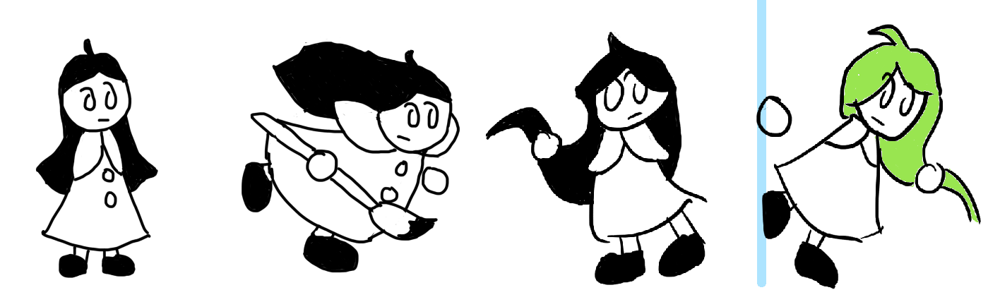
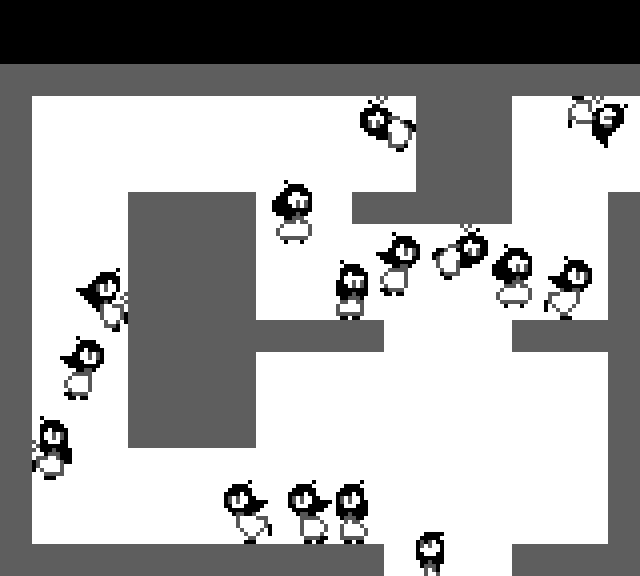

# GB Homebrew 2

This is a little GBC game that I worked on a little bit during the summer of 2021, based on the source for Aqua and Ashes. It is incomplete, because things came up and I had to drop the project, but you can run around and jump (a heck of an improvement from A&A!)

The idea for this game came when I was using a game idea generator, with the prompts "painting" and "nothing is permanent". I decided, then, to make a sort of Celeste style game with the colored gels from Portal 2.

The (unnamed) player character uses her hair to paint surfaces she contacts. She can switch between 4 types of gels: bouncy (orange), sticky (green), speedy (blue), and clear (white). You'd progress through levels using these mechanics to reach the top/right of the screen.

